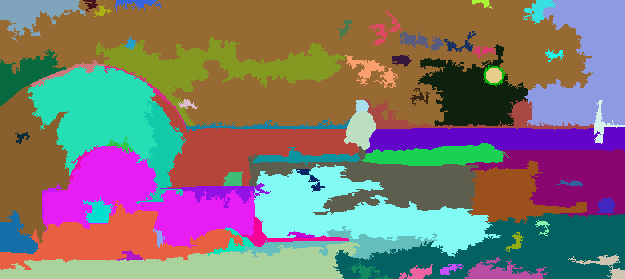
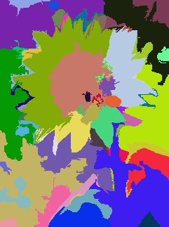
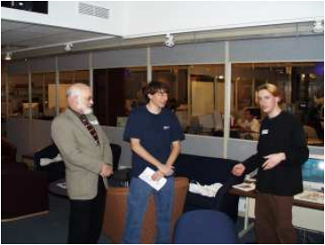
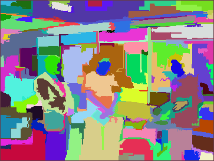
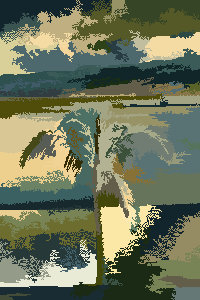

# Graph-Based-Image-Segmentation
This project revolved around implementing an efficient graph-based image segmentation algorithm, which was first proposed in the International Journal of Computer Vision (IJCV) in 2004 by Pedro F. Felzenszwalb and Daniel P. Hutenlocher. 

In essence, this program takes an image and segments the different discernible regions by grouping together segments of an image that are roughly the same color, thus recognizing the separate regions of the image.

